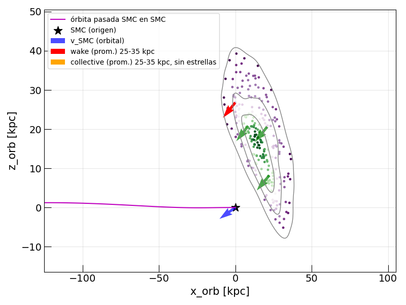
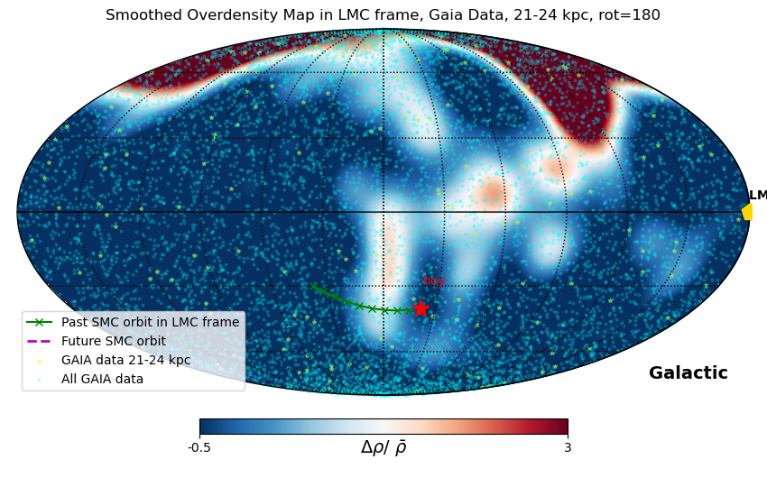
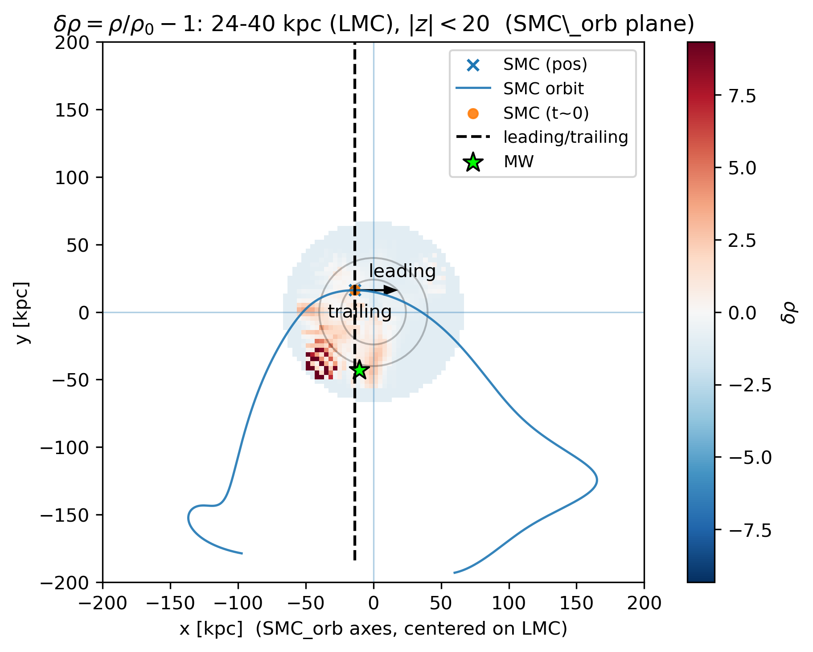
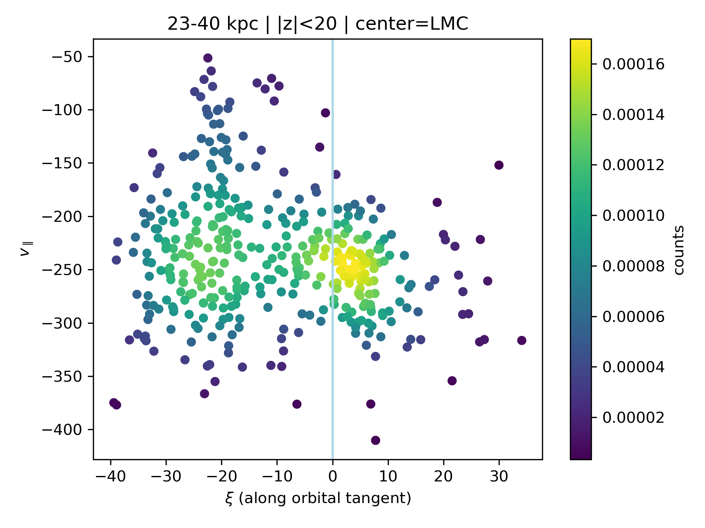
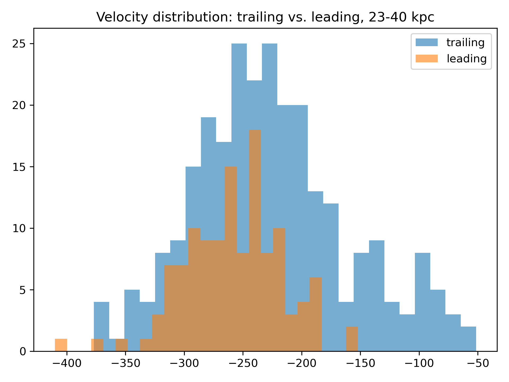

# Kinematic Analysis of the Magellanic System: SMC-LMC Host-Satellite Dynamics

 `mollviews-quiver-NUEVO.ipynb`

 `quiver-LCM-host-SMC.ipynb`

## Data Science Skills Demonstrated
- Processing and querying large astronomical catalogs (**1M+ objects**, Gaia DR3)
- Coordinate system transformations in high-dimensional space
- Spatial data visualization (Mollweide projections, HEALPix pixelization)
- Statistical hypothesis testing (Welch's t-test) on real observational data
- Building end-to-end analysis pipelines in Python

## Overview

This project analyzes the kinematic structure of the Magellanic System using real observational 
data from the Gaia DR3 survey. It combines coordinate transformations, velocity field visualizations 
(quiver plots), and overdensity analysis to study the influence of the SMC on the LMC and detect a 
possible stellar wake.

This work was developed as part of doctoral research at IATE (UNC) and extends the
methodology of Garavito-Camargo et al. (2019) and Fushimi & Mosquera (2024)
to the SMC-LMC orbital frame.

---

## Scientific Context

The Large Magellanic Cloud (LMC) and Small Magellanic Cloud (SMC) form a bound
satellite system of the Milky Way. While most studies focus on the LMC's influence
on the MW halo, this project asks a different question:

> **Does the SMC produce a detectable kinematic signature in the stellar populations
> of the LMC, analogous to the dark matter wake induced by the LMC in the MW?**

To answer this, stellar tracers (globular clusters and RR Lyrae stars from Gaia DR3)
are analyzed in the **orbital reference frame of the SMC**, with the LMC as the host.
Stellar populations are classified into **Wake** and **Collective** components based
on their position relative to the SMC's orbit, and their mean velocity fields are
compared.

---

## What I Did

### 1. Coordinate Transformations
- Transformed Gaia DR3 observational coordinates (RA, Dec, distance, proper motions,
  radial velocity) into the **orbital reference frame of the SMC** using Astropy and Gala
- Defined a rotated coordinate system aligned with the SMC's past orbital trajectory
  around the LMC

### 2. Stellar Population Classification
- Classified stars into **Wake** and **Collective** populations based on their
  3D position relative to the SMC's orbital plane
- Applied radial cuts at 25–35 kpc from the LMC center

### 3. Velocity Field Visualizations
- **Mollweide projections** of stellar density and velocity fields — implemented
  using HEALPix pixelization, adapting existing tools to the LMC/SMC reference frames
- **2D Quiver plots** in the SMC orbital plane — adapted from Fushimi & Mosquera's
  original implementation
- **3D Quiver plots** showing the full 3D velocity structure

### 4. Statistical Analysis
- **Welch's t-test** comparing mean velocities between Wake and Collective populations
- Density field computation and overdensity mapping (ρ/ρ_mean − 1)

---

## Results

### 2D Quiver: Velocity Fields in the SMC Orbital Plane

*Velocity fields of Wake (red) and Collective (orange/green) stellar populations
in the orbital plane of the SMC, with the LMC as host. Points are colored by
overdensity ρ/ρ_mean − 1. The SMC position is marked by the black star; its
orbital velocity by the blue arrow. The pink line shows the past orbit of the SMC.*

### Smoothed Overdensity Map in LMC Frame

*Smoothed overdensity map (Δρ/ρ̄) in the LMC reference frame using Gaia DR3
data at 21-24 kpc. The past orbit of the SMC in the LMC frame is shown in green;
the SMC's present position is marked by the red star.*

### Alternative Wake Detection: Residual Density and Phase-Space Analysis
#### Inspired by Foote et al. (2026), Figure 3f

As an alternative to Mollweide projections, the SMC-induced wake in the LMC 
is also investigated through residual density maps and phase-space analysis 
in the SMC orbital plane.

*Residual overdensity map at 24-40 kpc in the SMC orbital plane (|z| < 20 kpc).
The dashed line separates leading and trailing regions.*

*Phase-space diagram: parallel velocity v∥ vs angular position ξ along the 
orbital tangent, 23-40 kpc.*

*Velocity distribution comparing trailing (blue) vs leading (orange) stellar 
populations at 23-40 kpc.*

> **Note:** Results are preliminary and under scientific validation as part of
> ongoing doctoral research.

---

## Technical Stack

| Tool | Purpose |
|---|---|
| `Python 3.10` | Core language |
| `Pandas` | Data manipulation (Gaia DR3 catalog) |
| `NumPy` | Vectorized computation |
| `Astropy` | Coordinate transformations, units |
| `Gala` | Galactic dynamics, orbit integration |
| `Galpy` | Gravitational potentials |
| `Healpy` | HEALPix maps, Mollweide projections |
| `Matplotlib` | All visualizations |
| `SciPy` | Statistical tests (Welch's t-test) |

---

## Data

- **Observational data**: Gaia DR3 survey — globular clusters and RR Lyrae stars
  in the Magellanic System. Publicly available at the
  [Gaia Archive](https://gea.esac.esa.int/archive/).
  The dataset was downloaded and pre-processed by Mercedes Mosquera and
  Keiko Fushimi (Universidad Nacional de La Plata).
  Raw data are not included in this repository.
- **Simulation data**: N-body simulations from Garavito-Camargo et al. (2019).
  Not included in this repository due to size.

---

## Acknowledgements

The 2D quiver plot implementation is based on code originally developed by
Mercedes Mosquera and postdoctoral researcher Keiko Fushimi (Universidad Nacional
de La Plata), who performed the kinematic analysis in the center of mass frame
of the Magellanic Clouds. I adapted their code to work in the orbital plane of
the SMC, using the LMC as the host system instead of the Galactic center.
Additional visualizations (Mollweide projections, 3D quiver plots) and the
statistical analysis of Wake vs Collective stellar populations were implemented
and adapted from existing tools in the community, under the guidance of
Dr. Mariano Domínguez (IATE, UNC), Dr. Mercedes Mosquera and Dr. Keiko Fushimi
(Universidad Nacional de La Plata).

---

## References

- Garavito-Camargo, N. et al. (2019). *Hunting for the Dark Matter Wake Induced
  by the LMC*. ApJ, 884, 51.
  [doi:10.3847/1538-4357/ab32eb](https://doi.org/10.3847/1538-4357/ab32eb)
- Fushimi, K. & Mosquera, M. et al. (2024). *A determination of the LMC dark matter
  subhalo mass using the MW halo stars in its gravitational wake*.
  [arXiv:2309.12989](https://arxiv.org/abs/2309.12989)
- Foote, H. et al. (2026). [arXiv:2601.00946](https://arxiv.org/abs/2601.00946)

---

## Author

**Margionet Fabiola Díaz** — BSc in Physics, Universidad de Los Andes, Mérida, Venezuela  
[GitHub](https://github.com/margiofabiolad)

*This project was developed during my doctoral research in Astronomy at the
Instituto de Astronomía Teórica y Experimental (IATE), UNC, under the supervision
of Dr. Mariano Domínguez and co-supervision of Dr. Mercedes Mosquera
(Universidad Nacional de La Plata).*
